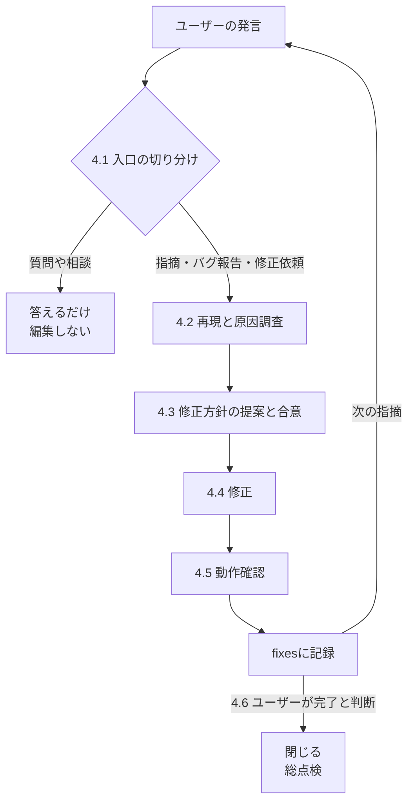

# AIの行動原則

このスキルにおけるAIの行動原則

## 禁止事項

このワークフローでは以下の行為を一切禁止とする

- 本番環境の**変更・デプロイ**
- 許可なくリモートリポジトリにブランチをpushする
- ユーザーの質問・指摘に対して、方針の合意を取らずにファイルを編集すること

## 行動規範

- ユーザーの質問には簡潔に回答すること。回答は「結論・サマリ」を最初に示し、詳細の説明が必要な場合はその後に述べること
- 質問・指摘を受けた際に、ユーザーとの方針の合意なしにソースコードを修正しないこと。質問・指摘に対しては回答するのみにとどめること
- サービスやライブラリの仕様・設定・使い方はcontext7(mcp)やweb検索で必ず公式の最新情報の裏取りを行うこと
- ユーザーへ質問をする際は、2~3つのアプローチを提示し、それぞれのトレードオフと推奨事項を明記する
- ユーザーへの応答で図を提示する場合、mermaidではなくASCIIで書くこと。CUIではmermaidがレンダリングされない。

## 文章規範

文章を作成するときの規範

- 共通
  - 構造・関係・流れを説明したい場合は Mermaid、箇条書き、表などで視覚化するとよい
  - Mermaidの利用用途
    - `flowchart` : コンポーネント間の関係
    - `sequenceDiagram` : API、deploy、認証などの時系列
    - `stateDiagram-v2` : 状態遷移
    - `erDiagram` : テーブルのリレーション、データモデルの概念説明
    - `classDiagram` : クラス・オブジェクトの依存関係
    - `architecture-beta` : アーキテクチャ図
  - 公式ドキュメントなどリファレンスのリンクは関連する文章の近くに置くこと。最後にまとめて参考文献の一覧としない。
  - なんらかの「説明」を記述する場合、冒頭に数行程度サマリを入れ、その章・項で何を説明するかを素早く把握できるようにすること
- 手順書
  - 「なんの目的で、なにを行う」という指示形式の文章で書くこと
  - 冗長な背景説明や補足は手順書に含めない
- アーキテクチャドキュメント
  - 全体像(設計思想、流れ、構造)を把握することを目的とする。
  - 技術的な詳細に踏み込んではいけない。技術的な詳細はソースコード、手順書、詳細説明用ドキュメントへのリンクとして逃がす。


# ワークフロー

## ワークフローの全体像

1. **設計**
    - ユーザーと共同で設計を行う  
    - 設計書: `.praxis/agent-tasks/<ブランチ名>/<TOPIC>/spec.md`
2. **実装計画**
    - 設計を細かいタスクに落とし込む  
    - 実装計画: `.praxis/agent-tasks/<ブランチ名>/<TOPIC>/plan.md`
3. **実装**
    - 実装計画に沿って実装する  
4. **確認・修正フェーズ**
    - ユーザーが実装や動作を確認してAIに質問や修正依頼を行う  
    - 修正記録: `.praxis/agent-tasks/<ブランチ名>/<TOPIC>/fixes.md`
5. **ADR記録**
    - このワークフローでの重要な設計判断をドキュメントに残す  
    - 設計判断記録: `docs/adr/<TICKET_ID>_<TITLE>.md`
6. **教訓の抽出**
    - このワークフローで受けた指摘を一般化しauto memoryに残す  


## 1. 設計

ユーザーと共同で設計を行う。


| 作成するファイル | パス |
| :--- | :--- |
| 設計書 | `.praxis/agent-tasks/<ブランチ名>/<TOPIC>/spec.md` |

### 1.1 情報収集と概念の理解

設計は正確な情報を前提に行わなければならない。

- 与えられたタスクに必要な情報(コード、ドキュメント、最新のコミット)をリポジトリ内から収集すること
- 対応するチケットがあればチケットの説明やコメントも参照すること
- 外部サービスやライブラリの仕様はcontext7(mcp)もしくはweb検索で最新の情報を調査すること。推奨構成やオプションが知識のカットオフ時点と変わっていることがある。

### 1.2 ブレインストーミング

収集した正しい情報を元にユーザーと共同で設計判断を行う
ブレインストーミングでは要件定義->基本設計->詳細設計の順でそれぞれ必要事項を話し合う

- **要件定義 (業務上の必要)**
  - 目的 : なんのためにこのタスクを行うのか。解決したい課題や達成したい目標。
  - 達成基準 : なにができたらこのタスクは成功なのか (テスト戦略と関連する)
  - 制約条件 : 環境、既存コードとの整合性、禁止事項
  - スコープ/非スコープ : やらないことの明確化
  - 業務要件: As-Is/To-Be業務フロー、業務ルール(判断基準、承認ルート)、役割分担
  - 機能要件 : 必要な機能(機能一覧、概念データモデリング、権限設計)
  - 非機能要件 : 性能、セキュリティ、可用性、運用・保守
- **基本設計 (アーキテクチャ)**
  - 技術選定
  - 構成 : インフラ構成, ネットワーク構成, ミドルウェア・プラグイン構成, マイクロサービス構成
  - 処理フロー : マイクロサービスアーキテクチャのような複数コンポーネントをまたぐような処理のフロー
  - 認証認可方式
  - API設計
  - DBの論理設計
  - エラーハンドリング
  - ロギング
  - バッチ・ジョブ設計
  - UIUX設計
  - DBの論理設計
  - テスト・動作戦略 : 仕様に沿っていることをどうやって確認するか。これが達成基準になる
  - CICD設計
- **詳細設計**
  - ディレクトリ構成
  - クラス設計 (DDD, SOLID原則)
  - 処理フロー
  - 単体テスト仕様
  - 具体的な設定
- **テスト・動作確認戦略**
  - 正しい動作を事前に定義し成功基準を明確にすること
- **ドキュメントの修正箇所の把握**
  - ドキュメントの修正や新規作成もスコープに含めること

#### 設計の基本原則

設計は以下の原則に従うこと

- **シンプル第一**: YAGNIを徹底すること。必要な箇所だけに手を加える。
- **怠慢の禁止**: 現在の実装に引きずられたり、一時しのぎの修正を行わない。問題の表面的な解決を目指すのではなく、根本原因を設計レベルで解決すること。
- **開放閉鎖の原則(OCP)**: ソフトウェアの構成要素は拡張に対して開かれており、変更に対して閉じていなければならない。長期的な運用・拡張が容易なアーキテクチャとすること。
- **普遍的な設計原則への準拠**: Clean Architecture, DDD, TDD, SOLIDの原則, GoFデザインパターンといった普遍的な設計原則に準拠すること

### 1.3 設計書の作成

ブレインストーミングで合意した仕様を設計書(`spec.md`)に書き起こす

- 大項目は「目次」「要件定義」「基本設計」「修正対象ファイル一覧」「詳細設計」
- 設計書に「とらなかった選択肢への言及」や「修正の履歴」は不要。決定事項のみを簡潔に説明すればよい。

### 1.4 設計レビュー

問題があればその場で修正すること、ただし、ユーザーと会話されていない設計判断が必要な箇所はユーザーに確認する

- `spec.md` が完成したら一度すべての内容を確認し、ブレインストーミングでユーザーと決めた仕様・設計に準拠しているかを確認する。
- 「TODO」「TBD」、未完成のセクション、曖昧な要件、矛盾がないかを確認する

### 1.5 ユーザーレビュー

spec.mdの内容をユーザーが確認する。修正が完了したら「2. 実装計画」に進む

---

## 2. 実装計画

エンジニアが当社のコードベースに関する知識を全く持たず、センスも疑わしいことを前提として、設計から包括的な実装計画を作成する。  

各タスクでどのファイルを変更する必要があるか、コード、テスト、確認する必要のあるドキュメント、テスト方法など、エンジニアが必要とするすべての情報を文書化する。
DRY, YAGNI, TDD, 頻繁なコミットを心がけること

| 作成するファイル | パス |
| :--- | :--- |
| 実装計画 | `.praxis/agent-tasks/<ブランチ名>/<TOPIC>/plan.md` |


### 2.1 実装計画の作成
#### ファイル構造

タスクを定義する前に、どのファイルが作成または変更されるのか、そしてそれぞれのファイルがどのような役割を担うのかを明確にする。  
この定義はタスク分解の重要な指針となる。各タスクはそれぞれ独立してテスト、承認・否認できる必要がある。

- 各ファイルには明確な役割が一つだけ割り当てられるべきである。多機能な大きなファイルよりも、小さくて目的に特化したファイルが望ましい
- 既存のコードベースでは、原則として確立されたパターンに従うこと

#### タスクの粒度

- タスクとは、独立してテスト可能な最小単位である。
- 「レビュアが隣接するタスクを承認しつつ、一方のタスクを一方のタスクを否認できるか」がタスクの分割基準
- 準備・設定・ドキュメントは、それを必要とする成果物のタスクに含める。

#### 実装計画のヘッダ文
すべての計画は、この見出しから始めなければなりません。

````markdown
# [機能名] 実装計画

**Goal:** [何を構築するのかを一文で記述]

**Architecture:** [アプローチについて 2〜3 文で記述]

**Tech Stack:** [主要な技術・ライブラリ]

**Spec:** [この計画が実装対象とする仕様書/設計書へのパス — 計画は仕様書を根拠に論を展開するため、仕様書は計画と常にセットで扱う。実行者は両方を読むこと]

## 全体制約 (Global Constraints)

[仕様書に記載されたプロジェクト全体の要件 — バージョン下限、依存関係の制限、命名規則および文言規則、プラットフォーム要件 — を 1 項目 1 行で、仕様書から正確な値をそのまま転記する。すべてのタスクの要件には、このセクションが暗黙的に含まれる。]
````

#### タスク構造


````markdown
### タスク N: [コンポーネント名]

**Files:**
- Create: `exact/path/to/file.py`
- Modify: `exact/path/to/existing.py:123-145`
- Test: `tests/exact/path/to/test.py`

**Interfaces:**
- Consumes: [このタスクが先行タスクから利用するもの — 正確なシグネチャ]
- Produces: [後続タスクが依存するもの — 正確な関数名、引数と戻り値の型。各タスクの実装者は自分のタスクしか見えないため、このブロックが隣接タスクで使われる名前と型を知る唯一の手段となる。]

- [ ] **Step 1: 失敗するテストを書く**

```python
def test_specific_behavior():
    result = function(input)
    assert result == expected
```

- [ ] **Step 2: テストを実行して失敗することを確認する**

Run: `pytest tests/path/test.py::test_name -v`
Expected: FAIL with "function not defined"

- [ ] **Step 3: 最小の実装を書く**

```python
def function(input):
    return expected
```

- [ ] **Step 4: テストを実行して成功することを確認**

Run: `pytest tests/path/test.py::test_name -v`
Expected: PASS

- [ ] **Step 5: コミット**

```bash
git add tests/path/test.py src/path/file.py
git commit -m "feat: add specific feature"
```
````

#### 実装計画の禁止事項

全てのステップには、エンジニアが必要とする実際の内容が含まれていなければならない。  
以下が書いてあった場合、実装計画の作成は失敗。絶対に書かないこと

- 「TBD」「TODO」「後で実装」「詳細を記入」
- 「適切なエラー処理を追加する」「検証を追加する」「例外的なケースを処理する」
- 「テストコードを作成すること」(実際のテストコードを書いていない)
- 「タスクNと同様」
- 手順を示さずにやるべきことだけを説明しているステップ (コードステップにはコードブロックが必要)
- タスク内で定義されていない型、関数、またはメソッドへの参照

### 2.2 実装計画レビュー

実装計画 (`plan.md`)を作成したら、改めて設計書(`spec.md`)と照らし合わせて以下の観点でレビューする

- **網羅性** : 設計書(`spec.md`)の各セクションに対応するタスクが存在しているか
- **禁止事項** : 実装計画(`plan.md`)が「実装計画の禁止事項」に定めた禁止事項に抵触していないか
- **ドリフト** : 設計書(`spec.md`)の合意に矛盾する実装がないか

問題が見つかった場合は、その場で修正すること。再レビューする必要はない。修正して次に進むこと。  
仕様要件にタスクが設定されていない場合は、タスクを追加すること。

### 2.3 実装計画作成後

「3. 実装」に進む

## 3. 実装

`plan.md` の実装は `/goal` に委ねる。`/goal` はユーザーからのみセットできるセッション機能のため、AIの役割は完了条件を組み立てて提示するところまでとする。

### 3.1 完了条件の組み立て

[公式ドキュメント](https://code.claude.com/docs/en/goal)の「Write an effective condition」に沿い、`plan.md`/`spec.md` から次を満たす完了条件を組み立てる。

- **測定可能な終了状態**: 例)`plan.md` の全タスクが完了していること
- **検証方法**: その終了状態をどう証明するか。例)「各タスクのテストコマンドがすべてPASSし、コミットされている」
- **重要な制約**: 途中で崩してはならない前提。例)「本番環境は変更しない」

### 3.2 ユーザーへの提示

組み立てた条件を次の形で提示する。

```text
/goal <組み立てた条件>
```

無人実行にしたい場合は auto mode の併用が必要であることを伝える。`/goal` 自体は権限モードを変えないため、Manual modeのままだとツール呼び出しのたびに確認が入る。

### 3.3 実実装完了後

ユーザーにレビュー観点を報告し「4. 確認・修正フェーズ」に進む


レビュー観点:
- タスクを完了するうえでAI独自の判断が入った箇所
- 仕様上のうまく動作しないリスクが高い個所
- AIによる確認が不完全な個所


## 4. 確認・修正フェーズ

実装まで完了した段階でユーザーによる確認・修正フェーズに入る

| 作成するファイル | パス |
| :--- | :--- |
| 修正記録 | `.praxis/agent-tasks/<ブランチ名>/<TOPIC>/fixes.md` |

### このフェーズの原則

- **合意なく編集を始めない** : 質問や相談は答えるだけで終わらせ、修正は方針の合意を得てから着手する
- **`spec` と `plan` は「あるべき姿」に保つ** : 修正によって変更された設計や実装を `spec` `plan` に反映する

### フロー



### 4.1 入口の切り分け

ユーザーの発言をまず2つに分類する。

**質問や相談に対していきなり修正を始めてはならない。** 相談は修正の依頼ではない。

| 入口 | 例 | 進め方 |
|------|---|--------|
| 質問・相談 | 「なぜこの実装にしたのか」「Aのほうがよくないか」 | 答えるだけ。コードもドキュメントも触らない |
| 指摘・バグ報告・修正依頼 | 「XXが動かない」「XXをYYに修正して」 | 4.2に進む |

- 相談の中に修正の意図が混ざっていて判断がつかない場合は、修正するかどうかをユーザーに確認する。推測で着手しない
- 指摘が複数同時に来た場合は `.praxis/agent-tasks/<ブランチ名>/<TOPIC>/fixes.md` に一覧化し、優先度を合意してから1件ずつ回す。まとめて着手すると、どの変更がどの結果をもたらしたかを切り分けられなくなる

### 4.2 再現と原因調査

- ソースコード、環境のログから事実を洗い出し、環境に変更を加えない範囲で状況の再現を試み、原因究明を行うこと。


> [!NOTE]
> 指摘は症状の報告であって修正方針ではない。「動作がおかしい」なら、期待する状態をユーザーに確認してから原因を追う。

### 4.3 修正方針の提案と合意

**このゲートを通らずにファイルを編集しない。**

- 提案に含めるもの: 原因、修正方針、影響範囲(触るファイルと層)、`spec` の仕様が変わるかどうか
- 指摘どおりに直すと別の要件を壊す場合は、その衝突を伝えて代替案を出す
- 方針が複数ありトレードオフがある場合は、推奨案を明示してユーザーに選ばせる
- 文言修正のように相談の余地がないものは、提案を省いて修正に進んでよい

### 4.4 修正

- 合意した方針で修正を行う。
- 合意した方針から外れる必要が生じたら、そのまま進めずユーザーに確認する
- 修正のスコープは最小に保ち、ついでのリファクタリングを混ぜない。

### 4.5 確認

- 本番環境への変更は行わず、修正内容に文法的ミスがないか、テストが通るかをチェックする
- `git commit` はユーザーに委ねる

### 4.6 記録

修正1件ごとに `.praxis/agent-tasks/<ブランチ名>/<TOPIC>/fixes.md` へ追記する。


| 対象 | 更新するタイミング |
|------|-----------------|
| `fixes` | 修正するたびに必ず |
| `spec` | 「あるべき姿」が変わったときだけ |
| `plan` | 実装計画そのものが変わったときだけ |

```markdown
## FIX-01 <指摘の要約>

- 指摘: ユーザーの指摘内容の要点
- 原因: 実証された原因(推測は書かない)
- 方針: 合意した修正方針
- 対応: 変更した内容と対象ファイル
- 確認: 指摘事項が解消したことの確認方法と結果
- 影響: `spec` `plan` の更新有無
```

### 4.7 修正フェーズを閉じる

ユーザーが修正の完了を判断したら、蓄積した修正を通しで総点検(このワークフローで行った変更・操作を対象として包括的なレビュー)する。

## 5. 重要な設計判断をドキュメントに残す

重要な設計判断を[MADR (Markdown Architectural Decision Records)](https://adr.github.io/madr/) を利用して、 `docs/adr/<TICKET_ID>_<TITLE>.md` に残す。

| 作成するファイル | パス |
| :--- | :--- |
| 設計判断記録 | `docs/adr/<TICKET_ID>_<TITLE>.md` |

- 今回の修正において、重要と思われる設計判断を抽出し、どれをADRに残すかをユーザーと相談する
- テンプレートはfullとminimalの2パターン。内容に応じて選択する。 (基本は minimal。fullでないと説明しきれない場合のみfull)
  - minimal: https://raw.githubusercontent.com/adr/madr/refs/tags/4.0.0/template/adr-template-minimal.md
  - full: https://raw.githubusercontent.com/adr/madr/refs/tags/4.0.0/template/adr-template.md
- ADRは日本語で記述する

## 6. 教訓の抽出

- ユーザーから受けた指摘で、他のタスクにも適用すべきものを一般化して教訓として auto memory に残す
- auto memory は更新のたびに棚卸しを行う。関連する既存メモリと結びつけや教訓の統廃合を行う
